# Terrain & Blocking Prop SVGs (24 Vector Assets)

Companion vector prop library created from specifications in `art/terrain-prompts.md`.

## 🎨 Design Rules Applied
- **SNES 16-Bit / Cel-Shaded JRPG Style**: Hard-edged color regions, dark bold contours (`#2a2333`), and 3-step value shading (lit top face, midtone front face, dark base).
- **Light Source**: Consistent upper-left illumination.
- **Silhouette & Height Rules**:
  - **Walls (`terrain-wall-*`)**: Tall solid blockers (`y=40..450`), edge-on top surface, occupying 85–95% cell height.
  - **Cover (`terrain-cover-*`)**: Low chest-high barricades (`y=230..450`), occupying lower ~55% of cell, broad lit top face viewing down onto it.

## 🔎 Read at 34px, not at 512

The assets are judged on `scripts/terrain-sheet.ts`, which renders them in the
real board markup at phone size beside the CSS they replace. Four rules came
out of that pass and are enforced by the generator rather than by hand:

- **Walls are scaled to 1.12** about the cell centre so a run of them abuts
  instead of reading as separate blocks with floor showing between. Cover is
  deliberately *not* scaled: visible floor above a barricade is the cue that
  says it is low enough to shoot over.
- **Strokes are thickened 60%.** A stroke of 8 in a 512 viewBox is 0.53 CSS
  pixels in a 34px cell — the contour is the whole reason these read as objects
  rather than as UI, and it was too fine to survive the only size that matters.
- **A theme's wall and its barricade never share a material.** Stone's
  barricades are timber and sandbags, not more masonry: where both props are
  grey brick the only thing separating them at 34px is height, which is a weak
  signal on a small tile.
- **Filter defs are emitted only where referenced** (4 of 24 files, not all 24).

---

## 📸 Asset Gallery

### Sheet 1 — `stone` (Ruined Masonry)

| Asset ID | Type | Preview |
|---|---|---|
| `terrain-wall-stone-a` | Wall (Tall) | 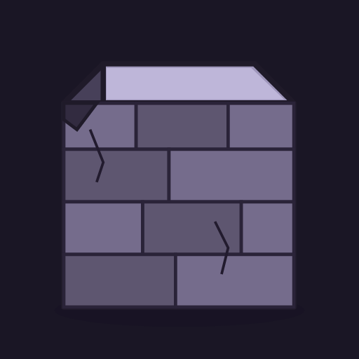 |
| `terrain-wall-stone-b` | Wall (Tumbled) | 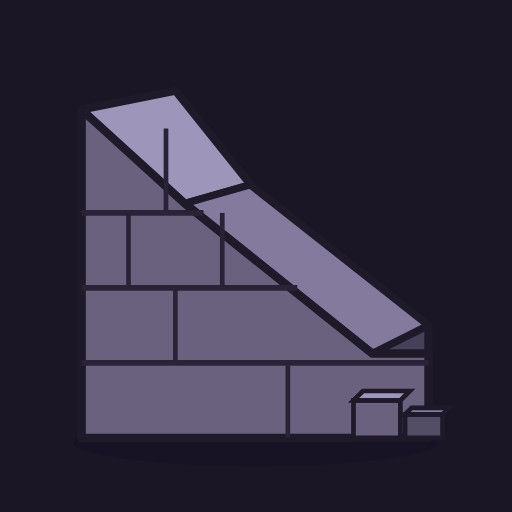 |
| `terrain-cover-stone-a` | Cover (Timber Palisade) | 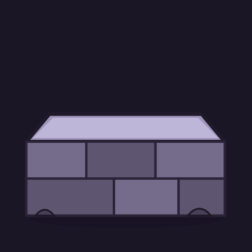 |
| `terrain-cover-stone-b` | Cover (Sandbags) | 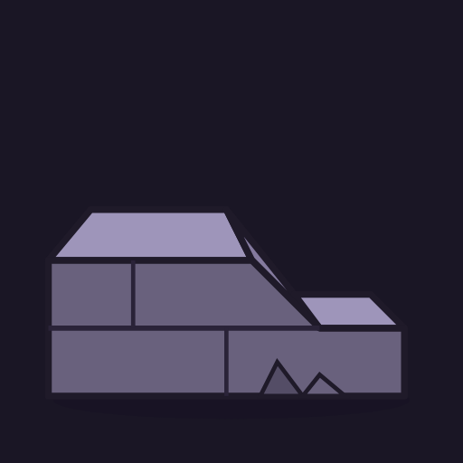 |

---

### Sheet 2 — `forest` (Undergrowth)

| Asset ID | Type | Preview |
|---|---|---|
| `terrain-wall-forest-a` | Wall (Shrub) | 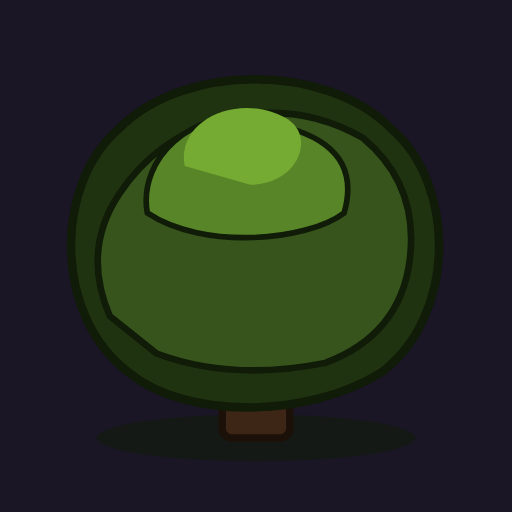 |
| `terrain-wall-forest-b` | Wall (Bush B) | 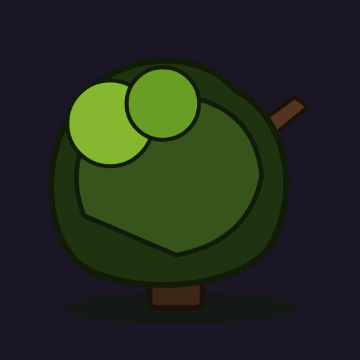 |
| `terrain-cover-forest-a` | Cover (Fallen Log) | 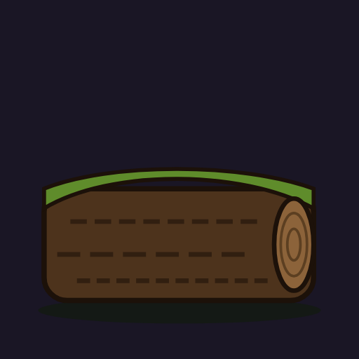 |
| `terrain-cover-forest-b` | Cover (Thicket) |  |

---

### Sheet 3 — `graveyard` (Memorial Stone)

| Asset ID | Type | Preview |
|---|---|---|
| `terrain-wall-graveyard-a` | Wall (Tombstone) |  |
| `terrain-wall-graveyard-b` | Wall (Obelisk) |  |
| `terrain-cover-graveyard-a` | Cover (Sarcophagus) | 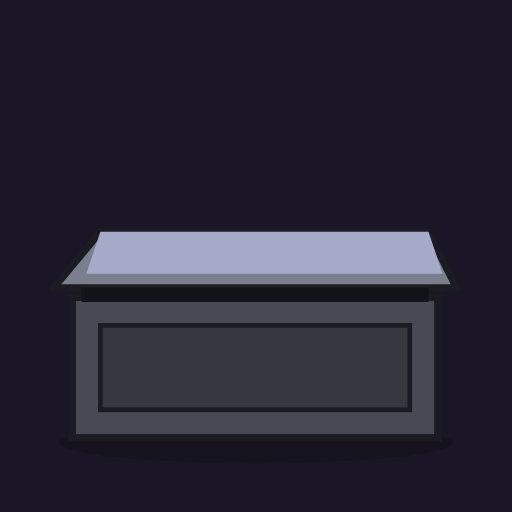 |
| `terrain-cover-graveyard-b` | Cover (Iron Railing) | 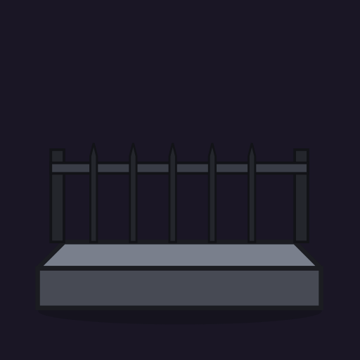 |

---

### Sheet 4 — `ember` (Volcanic Rock)

| Asset ID | Type | Preview |
|---|---|---|
| `terrain-wall-ember-a` | Wall (Basalt Spire) | 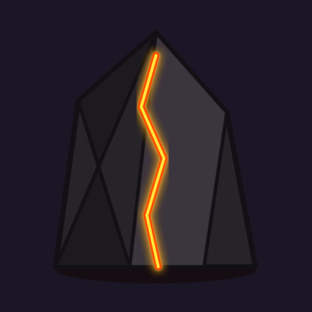 |
| `terrain-wall-ember-b` | Wall (Cooled Lava Chunk, ash-crusted) | 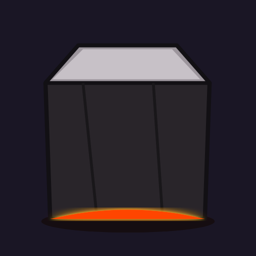 |
| `terrain-cover-ember-a` | Cover (Lava Ridge) | 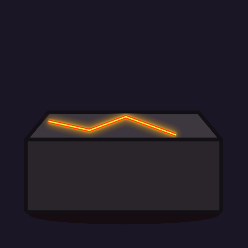 |
| `terrain-cover-ember-b` | Cover (Iron Plate Barricade) | 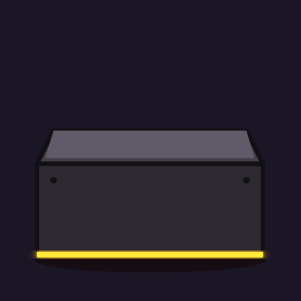 |

---

### Sheet 5 — `village` (Market Square)

| Asset ID | Type | Preview |
|---|---|---|
| `terrain-wall-village-a` | Wall (Market Stall Awning) |  |
| `terrain-wall-village-b` | Wall (Crates & Barrels) | 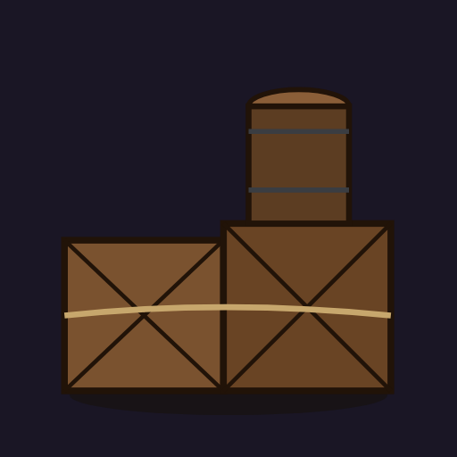 |
| `terrain-cover-village-a` | Cover (Overturned Handcart) | 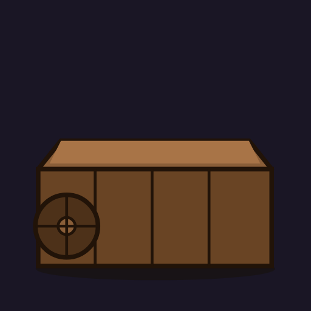 |
| `terrain-cover-village-b` | Cover (Fence & Trough) | 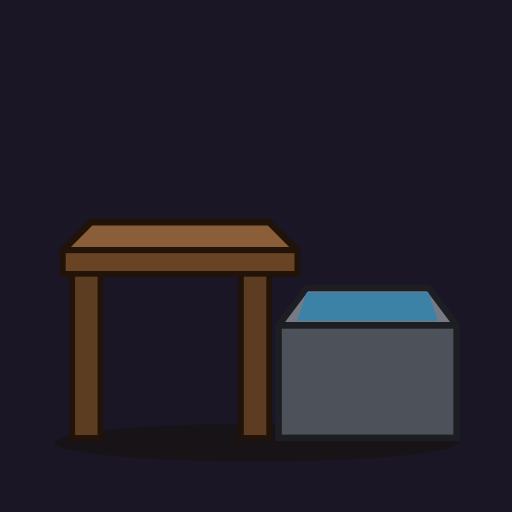 |

---

### Sheet 6 — `bog` (Wet Ground)

| Asset ID | Type | Preview |
|---|---|---|
| `terrain-wall-bog-a` | Wall (Moss Hummock) |  |
| `terrain-wall-bog-b` | Wall (Rotten Stump) | 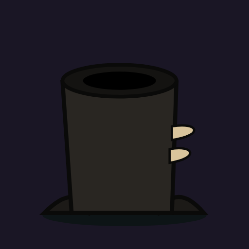 |
| `terrain-cover-bog-a` | Cover (Peat Bank) | 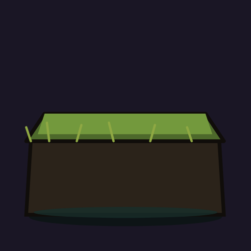 |
| `terrain-cover-bog-b` | Cover (Driftwood Tangle) | 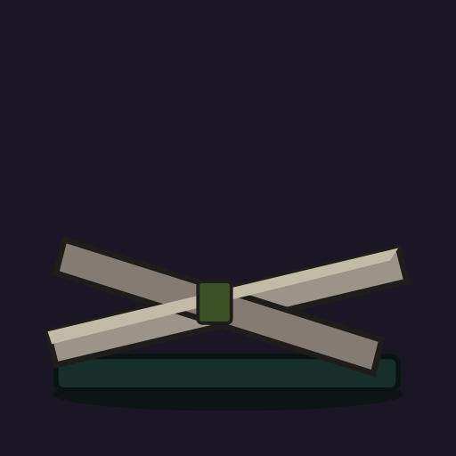 |
